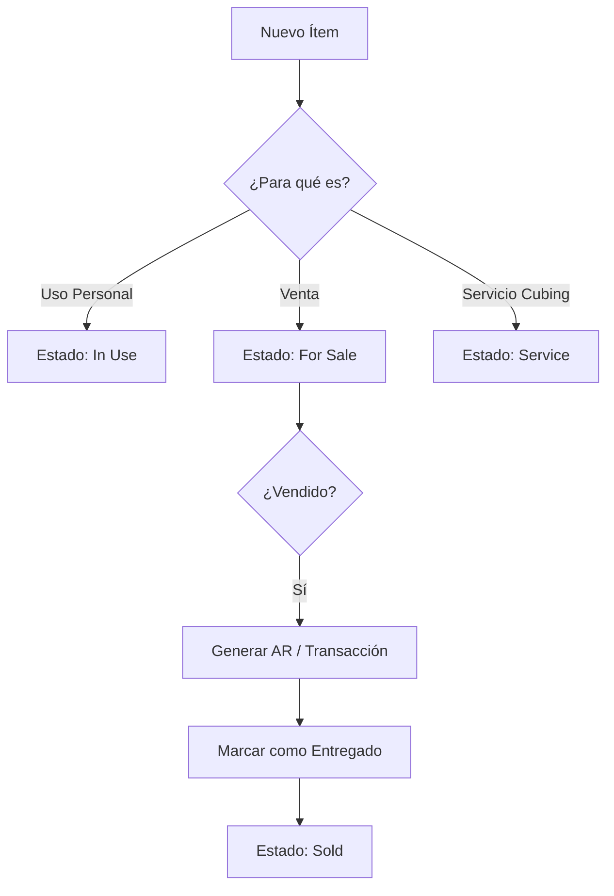
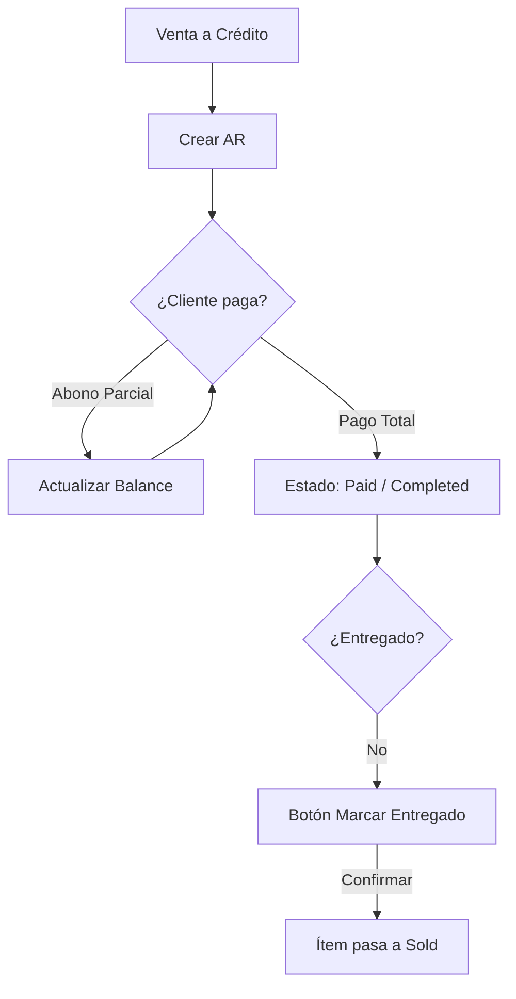
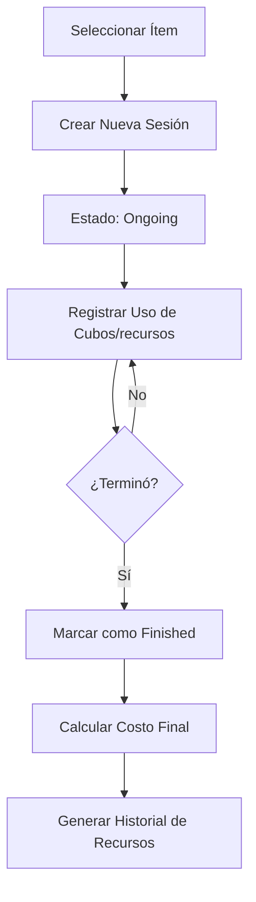

# Guía Funcional del Sistema (Wiki)

Esta guía proporciona una visión detallada de cada módulo del sistema, incluyendo sus campos, lógica de negocio y flujos de decisión. Está diseñada para usuarios que no tienen conocimientos técnicos sobre la infraestructura del sistema.

---

## Índice
1. [Inventario e Ítems](#1-inventario-e-ítems)
2. [Cuentas por Cobrar (AR)](#2-cuentas-por-cobrar-ar)
3. [Finanzas y Transacciones](#3-finanzas-y-transacciones)
4. [Gestión de Cuentas y Personajes](#4-gestión-de-cuentas-y-personajes)
5. [Sesiones de Cubing](#5-sesiones-de-cubing)
6. [Tareas y Eventos](#6-tareas-y-eventos)

---

## 1. Inventario e Ítems
Este módulo centraliza todos los equipamientos y objetos del sistema.

### Propósito
Gestionar el ciclo de vida de los ítems (desde su obtención hasta su venta o uso) y visualizar sus estadísticas detalladas.

### Interfaz y Campos (Modal "New Item")
| Campo | Origen (Tabla) | Editable | Función / Descripción |
| :--- | :--- | :---: | :--- |
| **Account** | `accounts` | Sí | Cuenta a la que pertenece el ítem. |
| **Character** | `characters` | Sí | Personaje que posee el ítem. |
| **Item Name** | `items` | Sí | Nombre descriptivo del objeto. |
| **Tier** | `items` | Sí | Rango de potencial (Rare, Epic, Unique, Legendary). |
| **Status** | `items` | Sí | Estado actual (In Use, For Sale, Sold, Bulk, Service, Cube, Trash). |
| **Price** | `items` | Sí | Precio de venta asignado (en USD). |

### Lógica de Negocio
*   **Venta Automática**: Cuando un ítem en estado `For Sale` se marca como **Entregado** en el módulo de AR, su estado cambia automáticamente a `Sold`.
*   **Modo Cube**: Si un ítem se asigna a una **Sesión de Cubing**, su estado cambia a `Cube` y no puede ser vendido hasta que la sesión finalice.

### Flujo de Decisión: Ciclo de Vida del Ítem

---

## 2. Cuentas por Cobrar (AR)
Gestiona las ventas realizadas a crédito y el seguimiento de pagos pendientes.

### Propósito
Asegurar que todas las ventas de ítems o servicios sean cobradas íntegramente y los objetos sean entregados solo tras la debida gestión.

### Interfaz y Campos (Tabla AR)
| Campo | Origen (Tabla) | Editable | Función / Descripción |
| :--- | :--- | :---: | :--- |
| **Client** | `clients` | No | Cliente que debe el dinero. |
| **Amount** | `accounts_receivable` | Sí | Monto total de la deuda. |
| **Paid** | `accounts_receivable` | Auto | Suma de todos los pagos registrados para esta deuda. |
| **Balance** | Calculado | No | Lo que resta pagar (`Amount - Paid`). |
| **Delivery Status** | `accounts_receivable` | Sí | Indica si el ítem ya fue entregado al cliente. |

### Lógica de Negocio
*   **Condición de Pago**: Un botón "Pay" permite registrar abonos. Si el `Balance` llega a 0, la AR se mueve a la pestaña "Completed".
*   **Condición de Entrega**: Al cambiar el estado de entrega a "Delivered", el sistema pide una confirmación irreversible. Esto actualiza también el estado del ítem vinculado a `Sold`.

### Flujo de Decisión: Gestión de Cobro

---

## 3. Finanzas y Transacciones
Control total del flujo monetario en USD y Mesos.

### Propósito
Registrar ingresos, gastos y movimientos de moneda del juego (Mesos) con categorización automática.

### Interfaz y Campos (Modal Transacción)
| Campo | Origen (Tabla) | Editable | Función / Descripción |
| :--- | :--- | :---: | :--- |
| **Type** | `transactions` | Sí | Income (Ingreso) / Expense (Gasto). |
| **Amount** | `transactions` | Sí | Valor numérico de la transacción. |
| **Description** | `transactions` | Sí | Detalle de la operación (ej. "Venta de Cubos"). |
| **Category** | `transactions` | Auto/Sí | Grupo financiero (Maple, Work, Daily Life, etc.). |

### Lógica de Categorización Automática
El sistema decide la categoría basándose en palabras clave en la descripción:
*   Si contiene "**cube**" o "**session**" -> Categoría: `Maple` / Sub: `Operating Expenses`.
*   Si contiene "**exchange**" o "**sell mesos**" -> Categoría: `Maple` / Sub: `Mesos`.
*   Si contiene "**rent**" o "**utilities**" -> Categoría: `Housing`.

---

---

## 4. Gestión de Cuentas y Personajes
Este módulo permite organizar la estructura de propiedad de los recursos e ítems.

### Propósito
Mantener un registro claro de qué ítems pertenecen a qué personajes y en qué cuenta están ubicados, además de trackear los recursos disponibles en cada una.

### Interfaz y Campos (Cuentas)
| Campo | Origen (Tabla) | Editable | Función / Descripción |
| :--- | :--- | :---: | :--- |
| **N°** | `accounts.number` | Sí | Número identificador de la cuenta. |
| **Email** | `accounts.email` | Sí | Correo asociado a la cuenta. |
| **Tag** | `accounts.tag` | Sí | Etiqueta personalizada (ej. Main, Bossing, Mule). |
| **Bright Cubes** | `accounts.bright_cubes` | Sí | Cantidad actual de Bright Cubes. |
| **Mesos B** | `accounts.mesos_b` | Sí | Cantidad de Mesos en la cuenta (Billion). |

### Lógica de Negocio
*   **Jerarquía**: Una `Cuenta` contiene múltiples `Personajes`. Los `Ítems` siempre están asociados a un `Personaje` y, por ende, a una `Cuenta`.
*   **Gestión de Recursos**: El stock de cubos y otros consumibles se deduce automáticamente cuando se inician sesiones de cubing vinculadas a esa cuenta.

---

## 5. Sesiones de Cubing
Control detallado del gasto en cubos y subida de nivel de ítems.

### Propósito
Trackear cuántos recursos se consumen para mejorar un ítem, calcular el costo total de la sesión y registrar el resultado final.

### Interfaz y Campos (Módulo de Sesión)
| Campo | Origen (Tabla) | Editable | Función / Descripción |
| :--- | :--- | :---: | :--- |
| **Session Name** | `cube_sessions.name` | Sí | Nombre para identificar la sesión. |
| **Target Item** | `items` | No | El ítem que se está "cubeando". |
| **Bright Cubes Used** | `cube_sessions.cubes_used` | Sí | Cantidad de cubos gastados. |
| **Status** | `cube_sessions.status`| Sí | `Ongoing` (En curso) o `Finished` (Finalizada). |

### Lógica de Negocio
*   **Consumo Real**: Al finalizar una sesión, el sistema puede (según configuración) deducir los cubos usados del balance de la `Cuenta` vinculada.
*   **Costo de Sesión**: El sistema calcula el costo total basándose en el precio unitario de los recursos y genera una transacción de gasto automática para llevar el control financiero.

### Flujo de Decisión: Inicio y Cierre de Sesión

---

## 6. Tareas y Eventos
Planificación de actividades diarias y seguimiento de recompensas de temporada.

### Propósito
Organizar las rutinas del juego (Bossing, Daily Quests) y visualizar el progreso de eventos especiales.

### Lógica de Negocio (Tareas/Tasks)
*   **Progreso de Cuentas**: Las tareas muestran cuántas cuentas han completado la actividad hoy frente al total disponible.
*   **Reinicio**: Las tareas suelen tener un ciclo de vida diario o semanal. El sistema permite marcar el progreso por cuenta de forma individual.

---

*(Fin de la Wiki - Documento Completo)*

